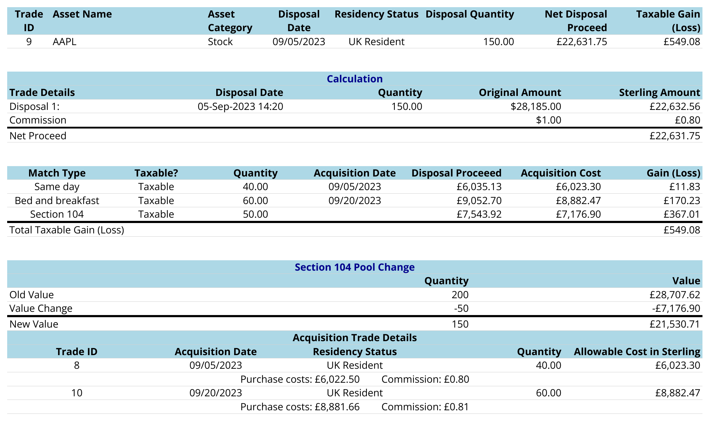
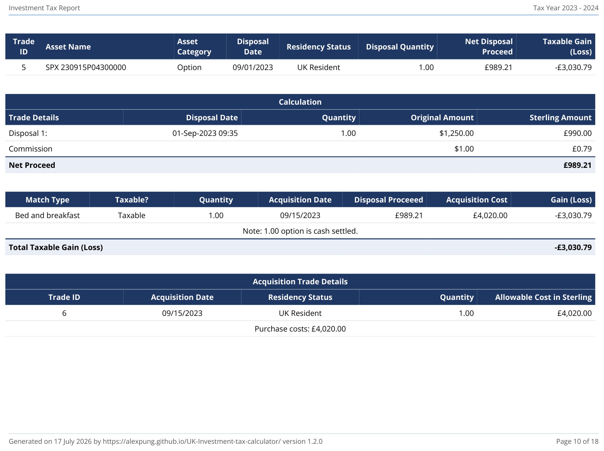
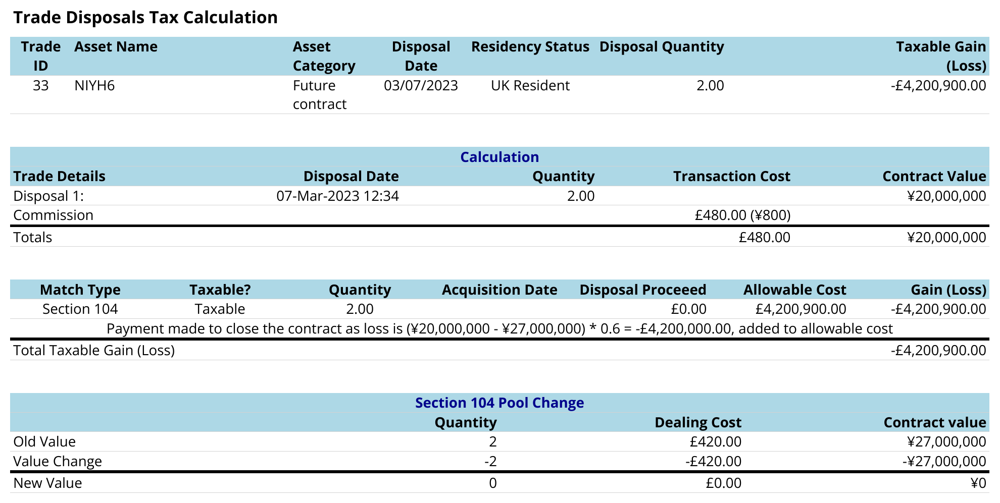
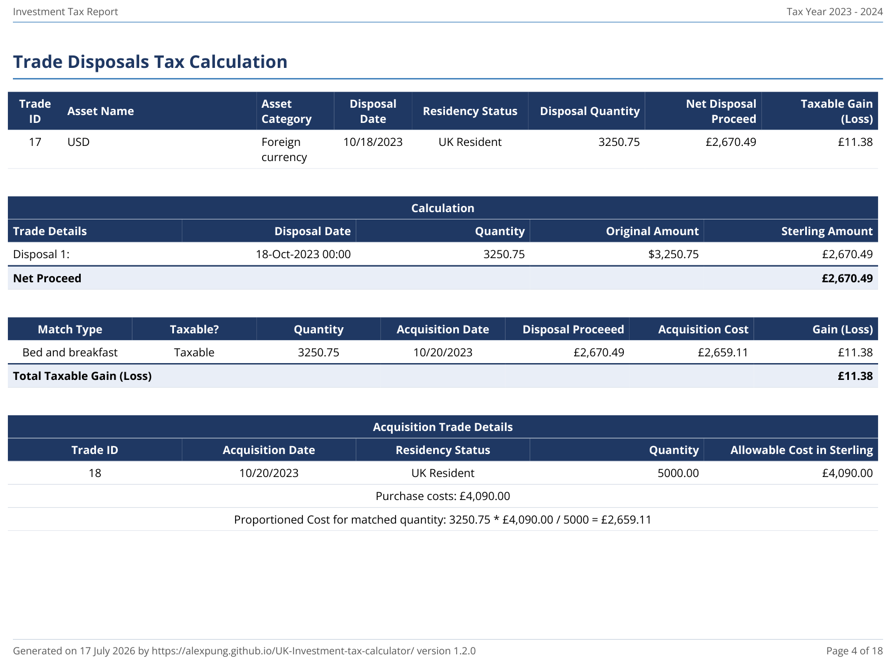
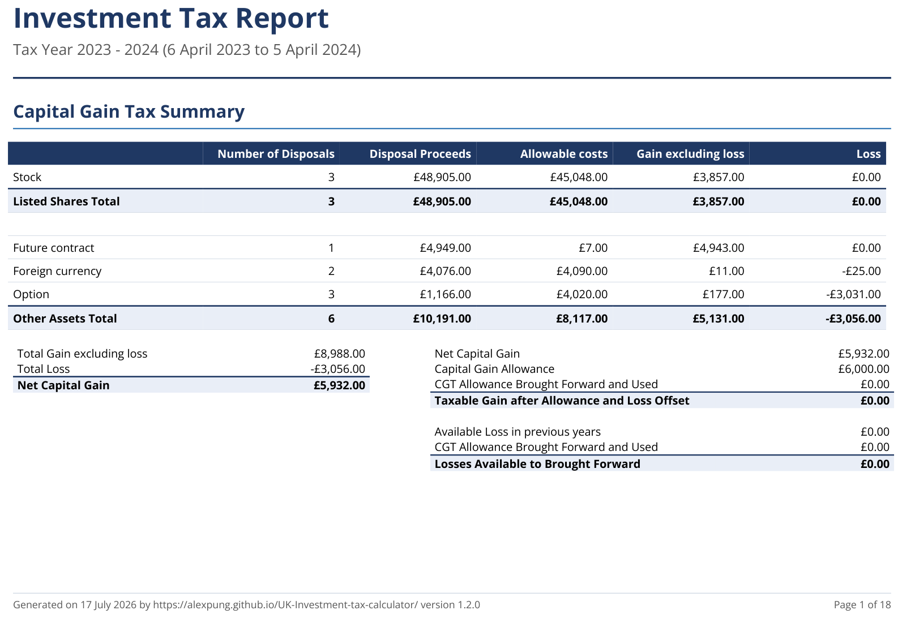
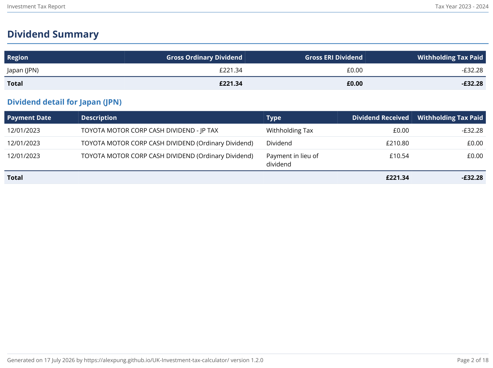
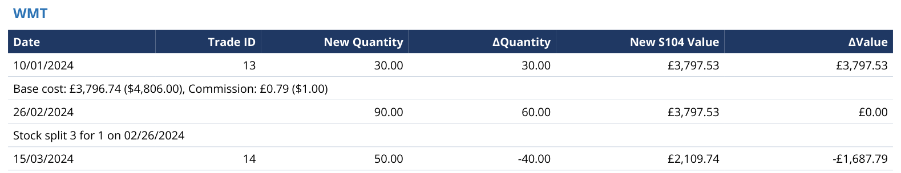
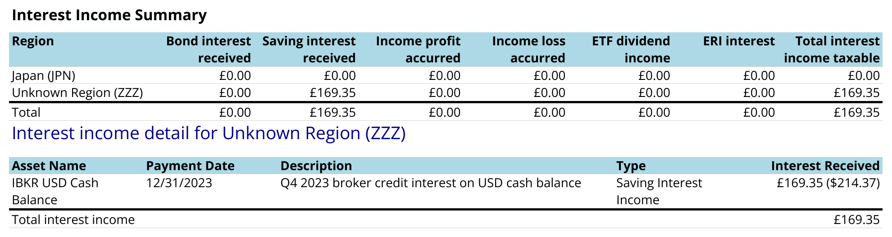
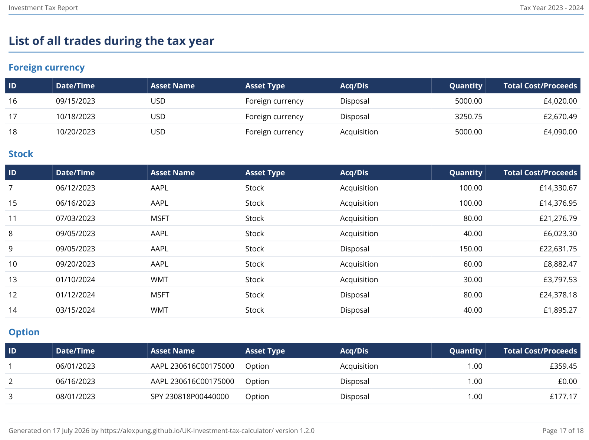
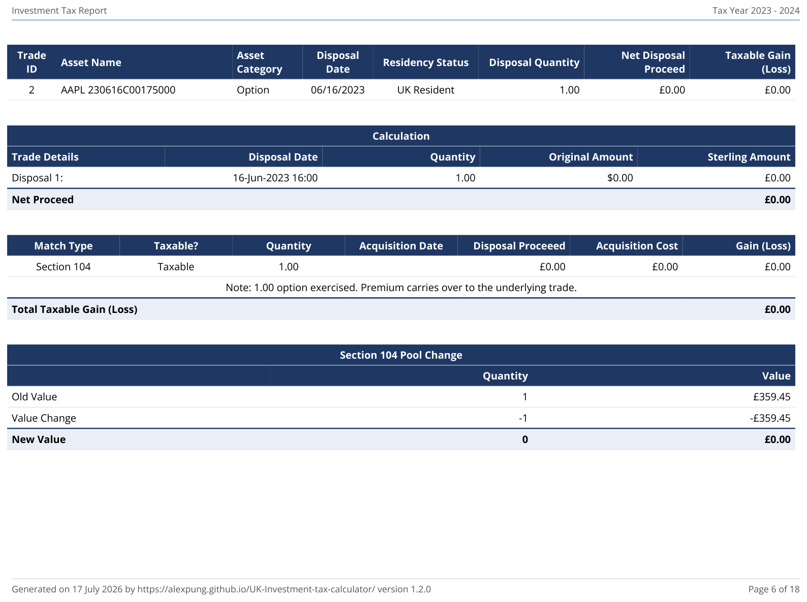

## UK investment tax calculator
UK tax calculator for Interactive Broker (limited support for FreeTrade/Trading212/interactive investor).
To help report UK tax for dividend and capital gain.

## What is included

1. Blazor WASM application ready to use.  
https://alexpung.github.io/UK-Investment-tax-calculator/

## What is so special about this project?
1. It is a web app so no installation required and you don't need to worry about malware.
2. Privacy oriented. There is no web server hosting your trade data, the entire calculation is done in your brower.
3. Support trades and dividends in foreign currency.
4. Support shorting and stock split corporate actions (forward and experimental support for reverse splits).
5. Implementation of TCGA92/S105 (1)(a): Multiple trades in the same day for the same Buy/Sell side is treated as a single trade. This affect same day/bread and breakfast calculation.
6. Support for **Excess Reportable Income (ERI) and Equalisation** for offshore funds/ETFs, including automatic cost base adjustment and region-based income reporting by detecting the ISIN country code. Units disposed of between the fund reporting period end and the fund distribution date take their share of the ERI/equalisation cost adjustment in the disposal computation (SI 2009/3001 reg. 99(5)); only the retained units' share is applied to the Section 104 pool on the fund distribution date (reg. 99(4)).
7. Support for UK specific tax rules such as TCGA92/S122 for small distributions in corporate actions (automatic gain deferral).

## Supported import format and brokers
| Category                | IB XML | FreeTrade CSV        | Trading212 CSV       | interactive investor CSV (experimental) |
|-------------------------|--------|----------------------|-----------------------|------------------------------------------|
| CashSettlement (Option) | O      |                      |                       |                                          |
| StockSplit              | O      |                      |                       |                                          |
| Dividend                | O      | Total in GBP         | Total in GBP          | Total in GBP (no withholding tax detail, company location unknown) |
| FutureContractTrade     | O      |                      |                       |                                          |
| FxTrade                 | O      |                      |                       |                                          |
| InterestIncome          | O      | Saving income in GBP | Saving income in GBP  | Saving income in GBP                     |
| OptionTrade             | O      |                      |                       |                                          |
| Trade (Stock)           | O      | Total in GBP         | Total in GBP          | Total in GBP (charges included in cash amount) |

### interactive investor (ii) CSV import — experimental
Export from the ii website (desktop): **Portfolio → Transaction history**, select the widest date range, then download as CSV. Export the **Trading account only** — ISA and SIPP activity is not taxable and should not be imported.

Notes and limitations:
1. **This parser is experimental**: it was written against the publicly documented shape of the ii export (`Date, Settlement Date, Symbol, Sedol, Quantity, Price, Description, Reference, Debit, Credit, Running Balance`) but has not yet been verified against a wide range of real exports. If your file is not recognised or rows are missed, please open a GitHub issue and attach an **anonymised** sample (replace amounts/references, keep the structure).
2. Buy/sell trades, dividends and cash interest are imported. Deposits, withdrawals, fees and transfers are ignored. Corporate actions (splits, takeovers etc.) are **not** in the ii export and must be entered manually on the "Add trades" page.
3. Trade amounts are taken from the cash Debit/Credit column, so dealing charges and stamp duty are already included in the acquisition cost / netted off the disposal proceeds (this is the correct all-in treatment for CGT).
4. The ii export has no ISIN, so the dividend company location is imported as *unknown* — review foreign dividends (e.g. for withholding tax, which ii does not itemise in this export; see your Consolidated Tax Certificate) and correct manually if needed.

A constructed example file is at [TaxExamples/InteractiveInvestor/TransactionHistoryExample.csv](TaxExamples/InteractiveInvestor/TransactionHistoryExample.csv).

[AllAssetTypesExample.xml](TaxExamples/AllAssetTypesExample.xml) is a single Interactive Brokers Flex Query file with realistic mock data (real tickers, prices and dates, all within one UK tax year) covering every row above except FxTrade and InterestIncome, which are entered manually rather than imported — those two are instead included in [AllAssetTypesExample.json](TaxExamples/AllAssetTypesExample.json), a full exported session (via the Import & Export page) with all of the above plus the manual entries. Import either file directly to explore the app with realistic data covering every category. See [Example](#example) below for a walkthrough of the resulting report.

User can also add trades and corporate actions (like Takeovers/Spinoffs) manually using the "Add trades" page.

You can also re-import a JSON file previously exported by this app (from the Import & Export page) to restore a saved session.

An example is included (see below). For other brokers I suggest copying the xml example and modifying it manually if you only have small number of trades.
Or if you can code new parsers are welcome.

## Can broker X statements be supported?
The system is designed to accomodate new parsers of different statement files convertiable to a string (or bytestream?).  
Anyone interested can implement a new parser implementing ITaxEventFileParser.  
https://github.com/alexpung/UK-Investment-tax-calculator/tree/master/BlazorApp-Investment%20Tax%20Calculator/Parser/InteractiveBrokersXml

## Current functionality
### Parsed trade type:
1. Trades:
    1. Stock orders
    2. Future contracts (closed, not settled)
    3. Capital gain from foreign currency
2. Dividend income
    1. Dividend cash income
    2. Witholding tax paid
    3. Dividend in Lieu.
3. Corporate actions
    1. Stock splits (forward and reverse splits with cash-in-lieu/rounding)
    2. Takeovers and Mergers (Manual input: shares + cash components)
    3. Spinoffs (Manual input: cost base allocation and cash-in-lieu)
4. Options (experimental, use with verification)
    1. Stock option execise/expiration/assignment.
    2. Financial option open/close (cash settlement)
5. Interest income
    1. Interest income from IB
    2. Bond coupon payment
    3. "Dirty" price accrued profit/loss
6. Excess Reportable Income (ERI)
    1. Automatic calculation based on holdings at accounting period end.
    2. Integrated into Dividend/Interest income summaries with residency filtering.
    3. Automatic Section 104 cost base adjustment.

#### Pending implementation
More corporate actions

#### Output files
1. Dividend summary by year.
2. Trade summary by year and trade details.
3. Section104 histories showing changes in the pool over time.

NEW: Customisable PDF export is now experimental.

## To use:
File sample: [Interactive Brokers stock trades XML example](https://github.com/alexpung/UK-Investment-tax-calculator/blob/master/TaxExamples/Stocks/InteractiveBrokersStockTradesExample.xml). You can download it and put it in the web app to see how it works.
1. You should configure the base currency of your IBKR account to GBP.
2. Create an Activity Flex Query in IBKR Client Portal. See [Interactive Brokers Flex Query configuration](#interactive-brokers-flex-query-configuration) below for the required sections, fields and settings.
3. Download the flex query for each year in xml format using web browser.
4. Open the web application.
5. Go to the Import section and select your files (or a whole folder). They are imported as soon as you select them &mdash; there is no separate upload step, and the files are read locally in your browser.
6. Press "Start Calculation".
7. If you hold offshore reporting funds (ETFs), go to the **ERI and Equalisation** page to add any Excess Reportable Income. The system will automatically detect the region from the ISIN and calculate the total adjustment based on your holdings.
8. Export the results by pressing the buttons at the export file section, or go to PDF export and create a report.

## Interactive Brokers Flex Query configuration

The calculator reads an Interactive Brokers **Activity Flex Query** downloaded in **XML** format. A regular activity statement will not work — a Flex Query is a separate, customisable report type that you configure once and can then run for any date range.

Official IBKR documentation: [Create an Activity Flex Query](https://www.ibkrguides.com/clientportal/performanceandstatements/activityflex.htm). The screenshots below are taken from that guide.

> **Important:** the base currency of your IBKR account should be GBP. The exchange rates in the file (`fxRateToBase`) are read as rates against sterling.

### 1. Create a new Activity Flex Query

Log in to [IBKR Client Portal](https://www.interactivebrokers.co.uk/portal) and go to **Performance & Reports → Flex Queries** (or **Menu → Reporting → Flex Queries**). Click the **+** icon next to *Activity Flex Query* and give the query a name (for example `UK tax calculator`).

### 2. Select the report sections

Add each of the sections listed below. Clicking a section opens a pop-up listing all the available fields for that section — the simplest approach is to press **Select All**. Extra fields and sections are ignored by the calculator, but if a required field is missing the import will show a parse error telling you which attribute to add to your query.


#### Trades — Level of detail: **Orders**

Used for stock, future and option trades.

Required fields: `levelOfDetail`, `assetCategory` (Asset Class), `buySell` (Buy/Sell), `symbol`, `isin`, `description`, `dateTime` (Date/Time), `quantity`, `proceeds`, `taxes`, `ibCommission` (IB Commission), `ibCommissionCurrency` (IB Commission Currency), `currency`, `fxRateToBase` (FX Rate to Base), `notes` (Notes/Codes).

For options the following are also required: `underlyingSymbol` (Underlying Symbol), `strike`, `expiry`, `multiplier`, `putCall` (Put/Call).

The Notes/Codes field is how the calculator tells an ordered trade from an option exercise ("Ex"), assignment ("A") or expiry ("Ep").

#### Cash Transactions — Level of detail: **Detail**

Used for dividends, payments in lieu of dividends, withholding tax and return of capital.

Required fields: `levelOfDetail`, `type`, `symbol`, `isin`, `description`, `settleDate` (Settle Date), `amount`, `currency`, `fxRateToBase` (FX Rate to Base).

ISIN must be included: the calculator detects the country of the dividend payer from the first two letters of the ISIN.

#### Corporate Actions

Used for forward and reverse stock splits. (Other corporate action types such as takeovers and spinoffs are not imported from the file — enter them manually in the app.)

Required fields: `type`, `symbol`, `description`, `dateTime` (Date/Time).

#### Statement of Funds — Level of detail: **Currency**

Used for capital gains on foreign currency balances, interest income (broker interest, bond coupons and accrued interest) and option cash settlements.

Required fields: `levelOfDetail`, `currency`, `activityCode` (Activity Code), `activityDescription` (Activity Description), `amount`, `date`, `reportDate` (Report Date), `settleDate` (Settle Date), `symbol`, `assetCategory` (Asset Class), `fxRateToBase` (FX Rate to Base), `issuerCountryCode` (Issuer Country Code).

### 3. Delivery configuration

- **Format: XML** — this is required, the calculator does not read the CSV or text formats.
- **Period**: anything is fine here; you can override the dates each time you run the query. IBKR limits a custom date range to 365 days, so plan on one file per year (see [Run and download](#5-run-and-download-the-query) below).


### 4. General configuration

- **Date Format: `dd-MMM-yy`** (`dd-MMM-yyyy` also works)
- **Time Format: `HH:mm:ss`** (`HHmmss` also works)
- **Date/Time Separator: single space**
- **Include Currency Rates?: Yes** — this adds the `<ConversionRates>` section to the file, which is needed to convert foreign currency transactions in the Statement of Funds to sterling. Without it the import fails with a "No fx rate found" error.


Press **Continue**, review the settings and press **Create**.

### 5. Run and download the query

Run the query from the Flex Queries page once for each year (IBKR limits a custom date range to 365 days), choose **XML** as the format, and save the file with your web browser. Import all the yearly files together into the calculator — full trade history from the very first trade is needed for the Section 104 pools to be correct.

## Privacy concerns:

Your trade data is not uploaded anywhere. They never leave your browser thanks to Blazor WASM framework. The calculation is entirely done in your browser.  

## Example

All the text and PDF excerpts below come from the same mock portfolio: [AllAssetTypesExample.xml](TaxExamples/AllAssetTypesExample.xml) (an Interactive Brokers Flex Query file with real tickers, realistic prices/dates and a real-world 3-for-1 Walmart stock split) plus two manually entered events, an FX trade and interest income, that can't be imported from a broker file — the combined session is [AllAssetTypesExample.json](TaxExamples/AllAssetTypesExample.json). Every trade below falls inside a single UK tax year (6 April 2023 to 5 April 2024) so it renders as one report.

For each example the text export comes first, followed by the matching PDF excerpt. The text comes from the "Export Trades" / "Export Dividends/Interest Income" / "Export Section104" buttons on the Import & Export page (raw files in [TaxExamples/PdfReportExample/text-exports](TaxExamples/PdfReportExample/text-exports)); the PDF excerpt is a screenshot from the same calculation, [SampleTaxReport-2023-2024.pdf](TaxExamples/PdfReportExample/SampleTaxReport-2023-2024.pdf). Both are generated from identical data, so the figures match exactly.

### Trade calculation: text export vs PDF report

#### Stock — same day / bed-and-breakfast / Section 104 matching

Text export:

```text
Disposal 1: Sold 150 units of AAPL on 09/05/2023 for £22,631.75.	Total gain (loss): £549.08
All units of the disposals are matched with acquisitions
Trade details:
	Sold 150 unit(s) of AAPL on 05-Sep-2023 14:20 for $28,185.00 = £22,632.56 Fx rate = 0.803 with total expense £0.80, Net proceed: £22,631.75
	Expenses: Commission: $1.00 = £0.80 Fx rate = 0.803	
Trade matching:
Tax status: Taxable
Same day: 40 units of the acquisition trade against 40 units of the disposal trade. Acquisition cost is £6,023.30
Matched trade: Bought 40 unit(s) of AAPL on 05-Sep-2023 14:15 for $7,500.00 = £6,022.50 Fx rate = 0.803 with total expense £0.80, Total cost: £6,023.30
	Expenses: Commission: $1.00 = £0.80 Fx rate = 0.803	
Gain for this match is £6,035.13 - £6,023.30 = £11.83

Tax status: Taxable
Bed and breakfast: 60 units of the acquisition trade against 60 units of the disposal trade. Acquisition cost is £8,882.47
Matched trade: Bought 60 unit(s) of AAPL on 20-Sep-2023 10:05 for $10,938.00 = £8,881.66 Fx rate = 0.812 with total expense £0.81, Total cost: £8,882.47
	Expenses: Commission: $1.00 = £0.81 Fx rate = 0.812	
Gain for this match is £9,052.70 - £8,882.47 = £170.23

Tax status: Taxable
At time of disposal, section 104 contains 200 units with value £28,707.62
Section 104: Matched 50 units of the disposal trade against the section 104 pool. Acquisition cost is £7,176.90
Gain for this match is £7,543.92 - £7,176.90 = £367.01

Resulting overall gain for this disposal: £11.83 + £170.23 + £367.01 = £549.08
```

PDF report:



#### Options — short index put assigned and cash settled

Text export:

```text
Disposal 3: Sold 1 units of SPX   230915P04300000 on 09/01/2023 for £989.21.	Total gain (loss): -£3,030.79.
All units of the disposals are matched with acquisitions
Trade details:
	Sold 1 unit(s) of SPX   230915P04300000 on 01-Sep-2023 09:35 for $1,250.00 = £990.00 Fx rate = 0.792 with total expense £0.79, Net proceed: £989.21
	Expenses: Commission: $1.00 = £0.79 Fx rate = 0.792	
	Option Details:
	Underlying Asset: SPX
	Option Type: PUT
	Strike Price: $4,300.00
	Expiry Date: 15-Sep-2023
	Trade Reason: Ordered trade

Trade matching:
Tax status: Taxable
Bed and breakfast: 1 units of the acquisition trade against 1 units of the disposal trade. Acquisition cost is £4,020.00
Matched trade: Bought 1 unit(s) of SPX   230915P04300000 on 15-Sep-2023 16:00 for Option Cash Settlement for: Assignment: $5,000.00 = £4,020.00 Fx rate = 0.804 with total expense £0.00, Total cost: £4,020.00
	Option Details:
	Underlying Asset: SPX
	Option Type: PUT
	Strike Price: $4,300.00
	Expiry Date: 15-Sep-2023
	Trade Reason: Option assigned

Gain for this match is £989.21 - £4,020.00 = -£3,030.79
1.00 option is cash settled.
```

PDF report:



#### Future contract — Nikkei/USD future (NIY), Section 104 matching

Text export:

```text
Disposal 1: Close long position 1 units of NIYZ3 on 12/01/2023.	Total gain (loss): £4,943.22
Trade details:
	Sold 1 unit(s) of NIYZ3 on 01-Dec-2023 09:00 with contract value ¥16,700,000 with total expense £3.13
	Expenses: Commission: ¥600 = £3.13 Fx rate = 0.00521	
Trade matching:
Tax status: Taxable
At time of disposal, section 104 contains 1 units with contract value ¥15,750,000
Section 104: Matched 1 units of the disposal. Acquisition contract value is ¥15,750,000 and disposal contract value ¥16,700,000, proportioned dealing cost is £3.16
Payment received to close the contract as gain is (¥16,700,000 - ¥15,750,000) * 0.00521 = £4,949.50, added to disposal proceed.
Total dealing cost is £6.28
Gain for this match is £4,949.50 - £6.28  = £4,943.22
```

PDF report:



#### FX — USD cash balance, bed-and-breakfast matching

Text export:

```text
Disposal 2: Dispose 3250.75 units of USD on 10/18/2023 for £2,670.49.	Total gain (loss): £11.38
All units of the disposals are matched with acquisitions
Trade details:
	Dispose 3250.75 unit(s) of USD on 18-Oct-2023 00:00 for FX gross proceed: $3,250.75 = £2,670.49 Fx rate = 0.8215. Description: Converted surplus USD trading cash back to GBP ahead of a property deposit
Trade matching:
Tax status: Taxable
Bed and breakfast: 3250.75 units of the acquisition trade against 3250.75 units of the disposal trade. Acquisition cost is £2,659.11
Matched trade: Acquire 5000 unit(s) of USD on 20-Oct-2023 00:00 for FX gross proceed: $5,000.00 = £4,090.00 Fx rate = 0.8180. Description: Wired USD consulting income into the brokerage account
Gain for this match is £2,670.49 - £2,659.11 = £11.38
```

PDF report:



### Report summaries: text export vs PDF report

#### Capital Gain Summary

Text export:

```text
Summary for tax year 2023:
Total gain in year £8,988.00
Total loss in year -£3,056.00
Net gain in year £5,932.00
Capital allowance available £6,000.00
Capital loss brought forward and used £0.00
Taxable gain after allowance and offset £0.00
Loss available to bring forward £0.00

Listed Shares and Securities:
Number of Disposals 3
Disposal Proceeds £48,905.00
Allowable costs £45,048.00
Gain excluding loss £3,857.00
Loss £0.00

Other assets:
Number of Disposals 6
Disposal Proceeds £10,191.00
Allowable costs £8,117.00
Gain excluding loss £5,131.00
Loss -£3,056.00
```

PDF report:



#### Dividend Summary

Text export:

```text
Tax Year: 2023
Region: JPN (Japan)
	Total dividends: £221.34
		(Ordinary: £221.34)
		(ERI: £0.00)
	Total withholding tax: -£32.28

	Savings interest: £0.00
	Bond interest: £0.00
	Accrued income profit: £0.00
	Accrued income loss: £0.00
	ETF dividend income: £0.00
	Excess Reportable Income (Interest): £0.00
	Total interest income: £0.00

		Dividend Transactions:
		Asset Name: 7203, Date: 12/01/2023, Type: Withholding Tax, Amount: -¥6,126, FxRate: 0.00527, Sterling Amount: -£32.28, Description: TOYOTA MOTOR CORP CASH DIVIDEND - JP TAX
		Asset Name: 7203, Date: 12/01/2023, Type: Dividend, Amount: ¥40,000, FxRate: 0.00527, Sterling Amount: £210.80, Description: TOYOTA MOTOR CORP CASH DIVIDEND (Ordinary Dividend)
		Asset Name: 7203, Date: 12/01/2023, Type: Payment in lieu of dividend, Amount: ¥2,000, FxRate: 0.00527, Sterling Amount: £10.54, Description: TOYOTA MOTOR CORP CASH DIVIDEND (Ordinary Dividend)
```

PDF report:



#### Section 104 — real 3-for-1 Walmart stock split, 26 Feb 2024

Text export:

```text
Asset Name WMT
Date		New Quantity (change)		New Value (change)		Contract value (for futures)
01/10/2024	30 (+30)				£3,797.53 (+£3,797.53)			
Base cost: £3,796.74 ($4,806.00), Commission: £0.79 ($1.00)
Involved trades:
Bought 30 unit(s) of WMT on 10-Jan-2024 09:45 for $4,806.00 = £3,796.74 Fx rate = 0.790 with total expense £0.79, Total cost: £3,797.53
	Expenses: Commission: $1.00 = £0.79 Fx rate = 0.790	

02/26/2024	90 (+60)				£3,797.53 (+£0.00)			
Stock split 3 for 1 on 02/26/2024

03/15/2024	50 (-40)				£2,109.74 (-£1,687.79)			
Involved trades:
Sold 40 unit(s) of WMT on 15-Mar-2024 10:30 for $2,391.00 = £1,896.06 Fx rate = 0.793 with total expense £0.79, Net proceed: £1,895.27
	Expenses: Commission: $1.00 = £0.79 Fx rate = 0.793	
```

PDF report:



### Sections only available in the PDF report

The PDF report has a few sections with no equivalent text export: an "Interest Income Summary" broken out separately from dividends, and a "List of all trades" appendix listing every acquisition and disposal grouped by asset category.

Interest Income Summary:



List of all trades in the tax year:



An option that is exercised (rather than cash settled) also has its own disposal entry, with the premium carried over into the cost of the underlying share purchase:


